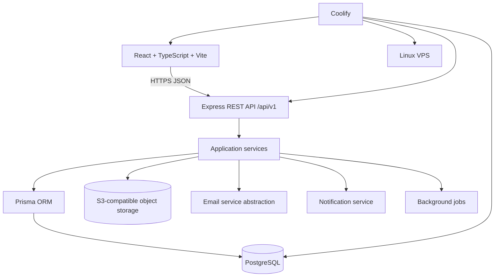
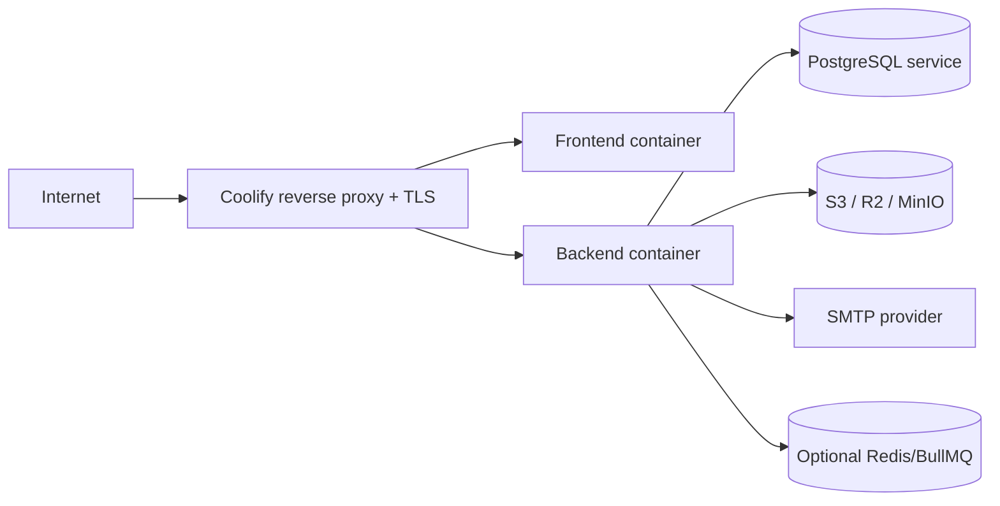

# AZAAM Platform Architecture

Status: **Phase 1 design baseline**

This document defines the production-oriented boundary for the AZAAM International Medics Network clinical attachment platform. The supplied workspace contains no source documents, so organization-specific legal, accreditation, partner, and approval claims remain `TO BE CONFIRMED`.

## System Context

## Deployment Topology

The frontend is a static Vite build served by a non-root web server. The backend is a non-root Node.js process. PostgreSQL and object storage are private services. Public certificate verification is served by the frontend and calls a deliberately minimized public API.

## Responsibilities

- **Frontend:** routing, responsive views, form UX, client-side Zod validation, query caching, and API calls through Axios. No database or secret access.
- **API routes/controllers:** HTTP concerns, authentication extraction, request validation, response envelopes, and status codes.
- **Services:** workflow transitions, ownership rules, capacity checks, notifications, audit events, and transactions.
- **Repositories/Prisma:** persistence and query composition only. Avoid N+1 queries and use indexed, paginated reads.
- **Object storage adapter:** private uploads, MIME/size checks, signed download URLs, and a virus-scanning integration point.
- **Notification/email adapters:** internal notifications first; email now; SMS/WhatsApp can be added behind the same port later.
- **Jobs:** asynchronous email, certificate/report generation, document processing, and cleanup. Redis is optional until workload justifies it.

## Core Lifecycle

`DISCOVER -> APPLY -> VERIFY -> APPROVE -> PLACE -> SUPERVISE -> TRACK -> EVALUATE -> COMPLETE -> CERTIFY -> VERIFY`

Applications and attachments use explicit transition services. Every transition validates actor permissions, current state, and required data, then writes status history, an audit log, and relevant notifications in one transaction where possible.

## Trust Boundaries

1. Public browser to API: HTTPS, CORS allowlist, rate limits, schema validation, secure cookies or short-lived access tokens.
2. Authenticated user to resource: RBAC permission plus resource ownership/scope checks.
3. API to storage: private bucket and signed URLs; never public static file serving.
4. Public verification: certificate ID lookup returns only minimum certificate fields, never passport, contact, address, or documents.
5. Operations: structured logs omit credentials, tokens, and unnecessary personal data.

## Domain Rules

- A student may be independent: `university_id` and `organization_id` are nullable; source is `INDEPENDENT`.
- Organizations are not implicitly accredited. Approval status is explicit and must be confirmed by AZAAM staff.
- Placement confirmation locks the relevant capacity row inside a transaction and rejects overbooking.
- Supervisors can query only placements assigned to their supervisor record unless a separate permission grants broader scope.
- Approved historical attendance cannot be edited by students.
- Certificate verification is public; certificate issuance and revocation are permission-controlled and audited.
- All timestamps are stored in UTC; display timezone is a user preference.

## Initial Decisions

- PostgreSQL + Prisma is the source of truth.
- REST API is versioned under `/api/v1`; frontend does not call Prisma directly.
- UUIDs identify database records; human-readable application and certificate numbers are separate unique fields.
- Access tokens are short-lived and refresh tokens are rotated and stored hashed if JWT is selected. Exact session strategy is an implementation decision for Phase 1.
- Initial language is English, with UI copy isolated for later English/Somali/Arabic localization.

## Open Decisions

- `TO BE CONFIRMED`: official logo, brand colors, contact details, domains, certificate template, and approved institutional names.
- `TO BE CONFIRMED`: regulatory/accreditation wording and actual host-organization approval evidence.
- Payment provider, queue provider, malware scanner, and email provider are adapters selected during implementation.
