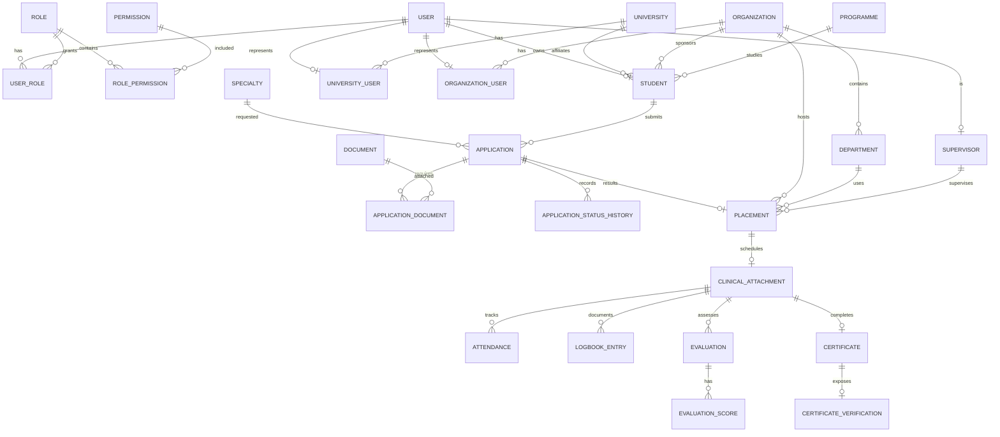

# AZAAM Database Design

Status: **Phase 1 design baseline**. PostgreSQL is required. All timestamps are UTC. UUIDs are used for primary keys; public numbers are separate unique identifiers.

## Entity Relationship Diagram



## Prisma Schema Baseline

```prisma
enum UserStatus { ACTIVE INACTIVE PENDING }
enum StudentSource { UNIVERSITY ORGANIZATION INDEPENDENT }
enum OrganizationStatus { PENDING UNDER_REVIEW APPROVED SUSPENDED REJECTED }
enum ApplicationStatus { DRAFT SUBMITTED UNDER_REVIEW DOCUMENTS_REQUIRED APPROVED PLACEMENT_PENDING PLACED SUPERVISOR_ASSIGNED ACTIVE COMPLETED CERTIFICATE_ISSUED REJECTED }
enum DocumentStatus { PENDING VERIFIED REJECTED EXPIRED }
enum AttendanceStatus { PRESENT ABSENT EXCUSED LATE }
enum EvaluationType { MID_TERM FINAL }
enum CertificateStatus { VALID REVOKED EXPIRED }

generator client { provider = "prisma-client-js" }
datasource db { provider = "postgresql" url = env("DATABASE_URL") }

model User {
  id String @id @default(uuid()) @db.Uuid
  email String @unique
  passwordHash String
  status UserStatus @default(PENDING)
  timezone String @default("UTC")
  createdAt DateTime @default(now())
  updatedAt DateTime @updatedAt
  roles UserRole[]
  student Student?
  universityUser UniversityUser?
  organizationUser OrganizationUser?
  supervisor Supervisor?
  createdApplications Application[] @relation("ApplicationCreatedBy")
  auditLogs AuditLog[]
}
model Role { id String @id @default(uuid()) @db.Uuid; name String @unique; users UserRole[]; permissions RolePermission[] }
model Permission { id String @id @default(uuid()) @db.Uuid; key String @unique; roles RolePermission[] }
model UserRole { userId String @db.Uuid; roleId String @db.Uuid; user User @relation(fields: [userId], references: [id], onDelete: Cascade); role Role @relation(fields: [roleId], references: [id], onDelete: Cascade); @@id([userId, roleId]) }
model RolePermission { roleId String @db.Uuid; permissionId String @db.Uuid; role Role @relation(fields: [roleId], references: [id], onDelete: Cascade); permission Permission @relation(fields: [permissionId], references: [id], onDelete: Cascade); @@id([roleId, permissionId]) }

model Student { id String @id @default(uuid()) @db.Uuid; userId String @unique @db.Uuid; universityId String? @db.Uuid; organizationId String? @db.Uuid; programmeId String? @db.Uuid; source StudentSource; fullName String; phone String?; nationality String?; profileCompleted Boolean @default(false); countryId String? @db.Uuid; user User @relation(fields: [userId], references: [id]); university University? @relation(fields: [universityId], references: [id]); organization Organization? @relation(fields: [organizationId], references: [id]); programme Programme? @relation(fields: [programmeId], references: [id]); applications Application[]; placements Placement[]; @@index([universityId]); @@index([organizationId]); }
model University { id String @id @default(uuid()) @db.Uuid; name String; status String; users UniversityUser[]; students Student[]; applications Application[]; @@index([name]) }
model UniversityUser { userId String @id @db.Uuid; universityId String @db.Uuid; user User @relation(fields: [userId], references: [id]); university University @relation(fields: [universityId], references: [id]); }
model Organization { id String @id @default(uuid()) @db.Uuid; name String; status OrganizationStatus @default(PENDING); users OrganizationUser[]; students Student[]; departments Department[]; supervisors Supervisor[]; placements Placement[]; @@index([status, name]) }
model OrganizationUser { userId String @id @db.Uuid; organizationId String @db.Uuid; user User @relation(fields: [userId], references: [id]); organization Organization @relation(fields: [organizationId], references: [id]); }
model Department { id String @id @default(uuid()) @db.Uuid; organizationId String @db.Uuid; name String; organization Organization @relation(fields: [organizationId], references: [id]); placements Placement[]; @@unique([organizationId, name]) }
model Supervisor { id String @id @default(uuid()) @db.Uuid; userId String @unique @db.Uuid; organizationId String? @db.Uuid; user User @relation(fields: [userId], references: [id]); organization Organization? @relation(fields: [organizationId], references: [id]); placements Placement[] }
model Programme { id String @id @default(uuid()) @db.Uuid; name String; students Student[]; applications Application[] }
model Specialty { id String @id @default(uuid()) @db.Uuid; name String; applications Application[]; placements Placement[] }
model Country { id String @id @default(uuid()) @db.Uuid; name String @unique; students Student[]; cities City[] }
model City { id String @id @default(uuid()) @db.Uuid; countryId String @db.Uuid; name String; country Country @relation(fields: [countryId], references: [id]); @@unique([countryId, name]) }

model Application { id String @id @default(uuid()) @db.Uuid; applicationNumber String @unique; studentId String @db.Uuid; universityId String? @db.Uuid; programmeId String? @db.Uuid; specialtyId String? @db.Uuid; preferredCountryId String? @db.Uuid; preferredCityId String? @db.Uuid; preferredStartDate DateTime?; preferredEndDate DateTime?; clinicalInterests String?; preferredInstitutionId String? @db.Uuid; noPreferredInstitution Boolean @default(false); source StudentSource; status ApplicationStatus @default(DRAFT); rejectedReason String?; rejectedAt DateTime?; rejectedById String? @db.Uuid; student Student @relation(fields: [studentId], references: [id]); university University? @relation(fields: [universityId], references: [id]); programme Programme? @relation(fields: [programmeId], references: [id]); specialty Specialty? @relation(fields: [specialtyId], references: [id]); documents ApplicationDocument[]; history ApplicationStatusHistory[]; placement Placement?; createdAt DateTime @default(now()); updatedAt DateTime @updatedAt; @@index([status, createdAt]); @@index([studentId]) }
model Document { id String @id @default(uuid()) @db.Uuid; ownerId String @db.Uuid; documentType String; fileName String; filePath String; mimeType String; fileSize Int; status DocumentStatus @default(PENDING); uploadedById String @db.Uuid; createdAt DateTime @default(now()); applications ApplicationDocument[]; @@index([ownerId, status]) }
model ApplicationDocument { applicationId String @db.Uuid; documentId String @db.Uuid; application Application @relation(fields: [applicationId], references: [id], onDelete: Cascade); document Document @relation(fields: [documentId], references: [id]); @@id([applicationId, documentId]) }
model ApplicationStatusHistory { id String @id @default(uuid()) @db.Uuid; applicationId String @db.Uuid; fromStatus ApplicationStatus?; toStatus ApplicationStatus; comment String?; changedById String @db.Uuid; createdAt DateTime @default(now()); application Application @relation(fields: [applicationId], references: [id], onDelete: Cascade); @@index([applicationId, createdAt]) }
model Placement { id String @id @default(uuid()) @db.Uuid; applicationId String @unique @db.Uuid; studentId String @db.Uuid; organizationId String @db.Uuid; departmentId String @db.Uuid; specialtyId String? @db.Uuid; supervisorId String? @db.Uuid; startDate DateTime; endDate DateTime; status String; application Application @relation(fields: [applicationId], references: [id]); student Student @relation(fields: [studentId], references: [id]); organization Organization @relation(fields: [organizationId], references: [id]); department Department @relation(fields: [departmentId], references: [id]); specialty Specialty? @relation(fields: [specialtyId], references: [id]); supervisor Supervisor? @relation(fields: [supervisorId], references: [id]); attachment ClinicalAttachment?; @@index([organizationId, departmentId, startDate, endDate]) }
model ClinicalAttachment { id String @id @default(uuid()) @db.Uuid; placementId String @unique @db.Uuid; status String; placement Placement @relation(fields: [placementId], references: [id]); attendance Attendance[]; logbookEntries LogbookEntry[]; evaluations Evaluation[]; certificate Certificate? }
model Attendance { id String @id @default(uuid()) @db.Uuid; attachmentId String @db.Uuid; date DateTime; status AttendanceStatus; checkIn DateTime?; checkOut DateTime?; comment String?; attachment ClinicalAttachment @relation(fields: [attachmentId], references: [id], onDelete: Cascade); @@unique([attachmentId, date]) }
model LogbookEntry { id String @id @default(uuid()) @db.Uuid; attachmentId String @db.Uuid; date DateTime; clinicalArea String; content Json; status String; supervisorComment String?; attachment ClinicalAttachment @relation(fields: [attachmentId], references: [id], onDelete: Cascade); @@index([attachmentId, date]) }
model Evaluation { id String @id @default(uuid()) @db.Uuid; attachmentId String @db.Uuid; type EvaluationType; status String; submittedById String @db.Uuid; attachment ClinicalAttachment @relation(fields: [attachmentId], references: [id], onDelete: Cascade); scores EvaluationScore[]; @@unique([attachmentId, type]) }
model EvaluationScore { id String @id @default(uuid()) @db.Uuid; evaluationId String @db.Uuid; category String; score Decimal @db.Decimal(5,2); maximum Decimal @db.Decimal(5,2); comment String?; evaluation Evaluation @relation(fields: [evaluationId], references: [id], onDelete: Cascade); @@unique([evaluationId, category]) }
model Certificate { id String @id @default(uuid()) @db.Uuid; certificateNumber String @unique; attachmentId String @unique @db.Uuid; status CertificateStatus @default(VALID); issueDate DateTime; revokedReason String?; attachment ClinicalAttachment @relation(fields: [attachmentId], references: [id]); verification CertificateVerification? }
model CertificateVerification { id String @id @default(uuid()) @db.Uuid; certificateId String @unique @db.Uuid; lastVerifiedAt DateTime?; certificate Certificate @relation(fields: [certificateId], references: [id], onDelete: Cascade) }
model AuditLog { id String @id @default(uuid()) @db.Uuid; userId String? @db.Uuid; action String; entity String; entityId String?; oldValue Json?; newValue Json?; ipAddress String?; userAgent String?; createdAt DateTime @default(now()); user User? @relation(fields: [userId], references: [id]); @@index([entity, entityId, createdAt]) }
```

The schema above is the core baseline, not the complete migration. Phase 1 implementation adds capacity, preferences, notifications, messages, invoices, payments, receipts, system settings, and configurable document/evaluation requirements as separate normalized models.

## Integrity Requirements

- Use transactions for application transitions, placement assignment, supervisor assignment, and certificate issuance.
- Enforce unique application numbers, certificate numbers, attendance per attachment/day, evaluation per attachment/type, and department names within an organization.
- Capacity is represented by a placement-capacity model keyed by organization, department, specialty, and date range. Placement confirmation locks the row and checks assigned count before incrementing.
- Add `createdById`/`updatedById` to mutable operational models where auditability requires it; avoid fake values for system actions.
- Add soft deletion only where business retention permits; do not physically delete audit history or certificate verification records.
